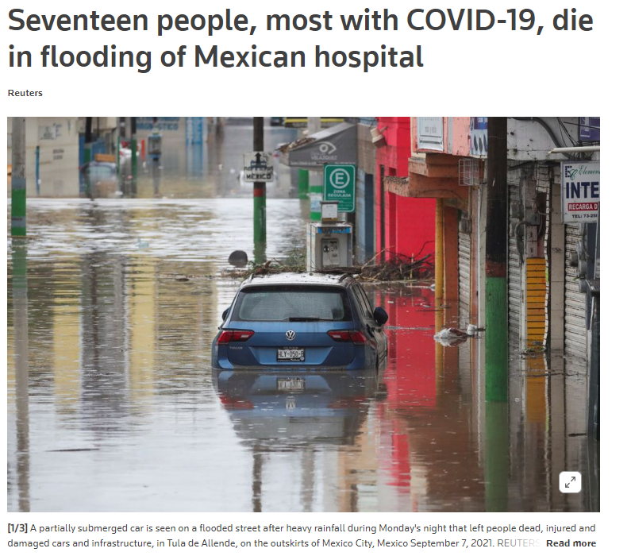

 

  <h3 align="center">Internet of Things Project</h3>
  <h3 align="center">Global Shared Learning - ITA & TEC</h3>
  <h4 align="center">InterWebbers Team</h4>

## Students

  - Andrea Samantha Aguilar Ramírez (TEC)
  - Ana Valeria Pérez Pérez (TEC)
  - José Francisco Lara Delgado (TEC)
  - Diego Andrés Figueroa Peart (TEC)
  - Alexandre Bergonsi Bernat (ITA)
  - Alvaro Tedeschi Neto (ITA)
  - Davi Muniz Vasconcelos (ITA)
  - Gabriel Henrique Gobi (ITA)
  - Thiago Lopes de Araujo (ITA)

## Motivation

The occurrence of floods comprises a global problem, whose harm to populations reaches proportions that comprise a logistical challenge for the authorities responsible for dealing with such a situation.
One of the main challenges comprises the mapping of the conditions of the problem, since the context of flooding shows extremely compromised visibility, with the need for constant overflights of rescue teams in order to be able to identify the location and condition of the victims.

The scenario described can exemplified in different contexts in the current scenario (2021-2022), such as:
- The flood that occurred on May 31, 2022 in the cities of Recife and Jaboatao dos Guararapes (Brazil), with at least 91 deaths and numerous missing persons:

Whose information was extracted from:

https://www.theguardian.com/world/2022/may/31/dozens-dead-in-brazil-floods-and-landslides-with-many-more-missing

- Flood resulted in seventeen deaths in hospital in the central Mexican state of Hidalgo on September 7, 2021:

Whose information was extracted from: 

https://www.reuters.com/world/americas/17-people-die-mexican-hospital-due-severe-flooding-2021-09-07/

In this vein, the motivation for this project is shown as an alternative in order to provide an application whose purpose is to facilitate the mapping of the number of existing victims and their locations, as well as the severity of the situation in which they find themselves.

With this objective in mind, the creation of a communication structure via mobile application associated with a communication network via drones with a crisis control station is seen as a promising alternative, given the availability of mobile equipment, in association with the capacity of drones being designed to fly over heavy rain scenarios and promote a mobile message routing system. The crisis management center, in turn, is capable of receiving information from the victims themselves and graphically mapping the rescue requests by position and severity of the individual's situation, considerably increasing the effectiveness of the rescue teams.

## About The Project

This project consists in, during a natural disaster and through a mobile application, provide the users with an interface in which they provide their location, the level of danger their on as a basic text message. Through an MQQT client connected in a drone, for example, the data will be sent through several of these drones, redirecting the signal of each person to the local Crisis Management Center. This data (once processed and aggregated to a database) will be displayed in a dashboard in which the operators of the Crisis Manegement Center will be able to see all of the signals and work on rescue operations.

## Project Requirements and User Stories
To see the project requirements and the user stories, check the [Kanban board](https://github.com/users/davimnz/projects/1) in the projects session of the repository.

## Architecture

    

## Installation and Setup

1. `git clone https://github.com/davimnz/gsl-iot-project-2022.git`

### MySQL setup
Since MySQL doesn't accept remote connections (other than local ones), we need to create a user specifically for managing the database from a remote user:
  - First we need to change the MySQL configuration to disable only local connections in `/etc/mysql/mysql.conf.d/mysqld.cnf`
  - In the file, search for the line `bind-address = 127.0.0.1` and comment it
  - Then restart MySQL: `sudo systemctl restart mysql`
  - We now access the MySQL console with: `sudo mysql -u root -p`
  - Now we create a new remote user: ``CREATE USER 'USERNAME'@'IPADDRESS' IDENTIFIED BY 'PASSWORD' WITH GRANT OPTION;
  #### NOTE: We can create a remote user from any IP address with `'USERNAME'@'%'` although this is not recommended for security reasons
  - Now we grant the user with access to the database we are going to use: `GRANT ALL PRIVILEGES ON databasename to 'USERNAME'@'IPADDRESS';`
This proccess will allow us to accessthe database from a remote machine, in this case this process is necessary for the Python program to acces the remote SQL database.

### Python Setup
To use Python with MySQL we need to install the correspondent dependencies with: `pip install mysql-connector-python`

### VM's Setup
1. Follow the Professor Marconde's tutorial on how to setup the Mininet Virtual Machine (Ubuntu with Mininet-wifi and mosquitto installed): 
    https://www.dropbox.com/s/bkib6vzqvfhpmtj/mininet-wifi-project-TEC-2022.mp4?dl=0
2. Change the Network Adaptor 2 'connected to' configuration to "Board in Bridge Mode".
3. Start the VM on virtual box.
4. Use two terminal inside this VM: one supposed to run the central configuration Mosquitto file; other one supposed to run the bridge's configuration file.
- For the central configuration file: `mosquitto -c mosquitto.conf -v`
- For the bridge configuration file: `mosquitto mosquitto_bridge.conf -v`
- REMINDER: for those commands to work, both config files should be in the present directory.
  
### Celular Setup
1. Follow the Professor Barreto's tutorial on how to configure MQTT with React Native for your operating system:
  https://github.com/kabartsjc/gsl-iot-2022/blob/main/templates/android/Android_Client_React_Native_Tutorial.pdf
2. Open the client folder: `cd /client`
3. Run the commands on it's README file:
    `npm install --force`
    `npx react-native start`
    `npx react-native run-android`

## Deliverables

- Client and Edge Stage: 
  
  > the presentation of the completeness of delivery regarding the client and network can be viewed through the following link:
  > https://drive.google.com/file/d/1aE8qR1RyihElATBoQanrAm80lTyvcDa4/view?usp=sharing
  > Link youtube
  > https://youtu.be/yVfZ9nq_cFc

##
- Cloud Implementation stage: 
  
  > the presentation of the cloud implementation through a Python program and the use of an SQL Databse can be seen in:
  > [https://drive.google.com/file/d/1lIf6yrpUf2LC-CPkCHGg42z8YCCDZjcB/view?usp=sharing]
  > Link youtube
  > Link: https://youtu.be/KCEq87psbH0

(<a href="#readme-top">back to top</a>)

- Final Workshop

  - [Presentation](final-presentation/final-presentation-workshop.pdf)
  - https://youtu.be/TcdbeCW2Acs
  
  ##
- Youtube Channel:
-  https://www.youtube.com/channel/UCHzg7rqS5NZCKdvLbWQ1a5g
